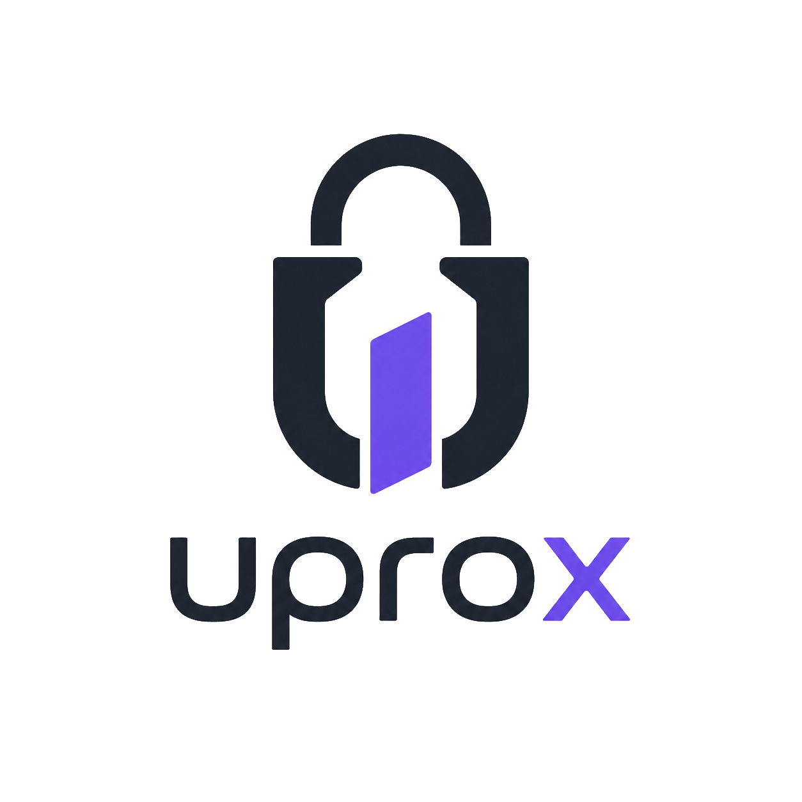
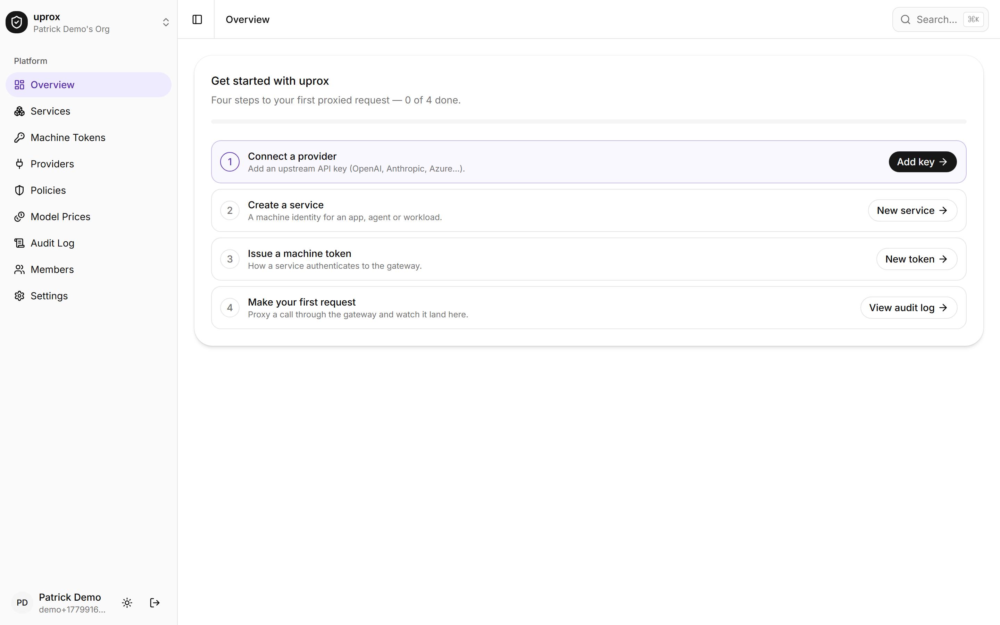
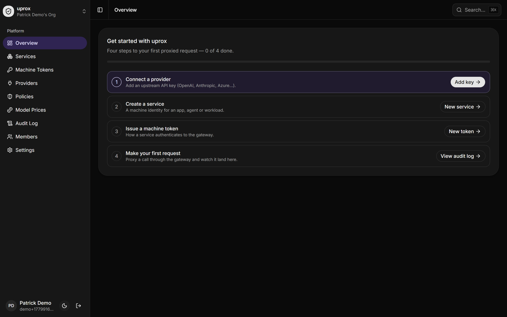

<div align="center">



# uprox

**One OpenAI-compatible endpoint for all your AI workloads — with auth, policy, and cost control built in.**

Point your apps and agents at uprox instead of OpenAI. Hand out revocable tokens instead of
raw provider keys, enforce per-service limits and budgets, and log every request.

[](https://svelte.dev/)
[](https://www.typescriptlang.org/)
[](https://orm.drizzle.team/)
[](./Dockerfile)

<br />

<table>
  <tr>
    <td width="50%"></td>
    <td width="50%"></td>
  </tr>
</table>

</div>

<br />

## Drop-in for the OpenAI SDK

Change two lines — the base URL and the key — and you're routing through uprox:

```ts
import OpenAI from 'openai';

const client = new OpenAI({
	apiKey: 'uprox_live_…', // a revocable machine token, not your real key
	baseURL: 'http://localhost:5173/v1'
});

await client.chat.completions.create({
	model: 'gpt-4o', // claude-* routes to Anthropic automatically
	messages: [{ role: 'user', content: 'Hello' }]
});
```

## What you get

|                    |                                                                              |
| ------------------ | ---------------------------------------------------------------------------- |
| **Machine tokens** | Revocable `uprox_live_…` tokens per service. Stored as a hash; shown once.   |
| **Multi-provider** | OpenAI, Anthropic, and Azure OpenAI behind one endpoint, routed by model.    |
| **Policies**       | Limit which providers/models a service may call, plus per-token rate limits. |
| **Budgets**        | Daily/monthly USD ceilings per service — over budget returns `402`.          |
| **Response cache** | Exact-match cache (streaming included) replays responses at zero cost.       |
| **Encrypted keys** | Provider keys sealed with AES-256-GCM; never exposed to clients.             |
| **Audit log**      | Every request logged with status, cost, and latency.                         |
| **Teams & SSO**    | Invite-only orgs and roles, with email/password or OIDC sign-in.             |

## Quick start

Needs [Node.js](https://nodejs.org), [pnpm](https://pnpm.io), and [Docker](https://www.docker.com).

```sh
pnpm install
cp .env.example .env                 # fill in BETTER_AUTH_SECRET + ENCRYPTION_KEY
pnpm db:start                        # Postgres via docker
pnpm db:migrate
pnpm dev
```

Open <http://localhost:5173>. On first run you'll land on a one-time **`/setup`** wizard to
create the administrator account (it becomes owner of the first organization). After that the
dashboard walks you through it: **add a provider key → create a service → issue a token → make
your first request.** New teammates join by invitation — see [Authentication](#authentication).

```sh
# generate ENCRYPTION_KEY
node -e "console.log(require('crypto').randomBytes(32).toString('base64'))"

# or run the whole thing in Docker
docker build -t uprox . && docker run -p 3000:3000 --env-file .env uprox
```

## Endpoints

OpenAI-compatible gateway, authenticated with a `Bearer uprox_live_…` token (or
`api-key: uprox_live_…` for Azure-SDK clients):

| Endpoint                    | Notes                                     |
| --------------------------- | ----------------------------------------- |
| `POST /v1/chat/completions` | streaming supported                       |
| `POST /v1/responses`        | OpenAI Responses API; streaming supported |
| `POST /v1/embeddings`       |                                           |
| `GET  /v1/models`           | aggregated from your configured providers |

### Azure OpenAI SDK clients

The same gateway is reachable under URLs the Azure OpenAI SDK builds, so you can
point an existing Azure-style client at uprox by swapping its `AZURE_OPENAI_ENDPOINT`
for your uprox base URL and its `AZURE_OPENAI_API_KEY` for an `uprox_live_…` token.

| Endpoint                                                  | Equivalent of                     |
| --------------------------------------------------------- | --------------------------------- |
| `POST /openai/deployments/{deployment}/chat/completions`  | legacy Azure URL (model from URL) |
| `POST /openai/deployments/{deployment}/embeddings`        | legacy Azure URL                  |
| `POST /openai/deployments/{deployment}/responses`         | legacy Azure URL                  |
| `POST /openai/v1/chat/completions` (and `/embeddings`, …) | newer Azure OpenAI v1 surface     |

The `api-version` query string is accepted and ignored. Model routing is identical
to `/v1/*` — the deployment name acts as the model id, and uprox proxies to Azure
when your org has Azure credentials configured (Azure accepts arbitrary deployment
names; see provider settings).

Everything else (services, tokens, providers, policies, audit) is managed in the dashboard or
via the session-authenticated REST API under `/api`.

## Tokens & security

- Machine tokens are opaque (`uprox_live_…`) and stored **only as a sha256 hash** — like a
  password. The plaintext is shown once at creation; revoking one fails its services instantly.
- Provider keys are encrypted at rest with **AES-256-GCM**; only the last 4 chars are kept for
  display, and the gateway swaps the token for the real key server-side — clients never see it.

## Authentication

uprox is **invite-only**. The first account is created once via the `/setup` wizard; everyone
else joins through an organization invitation (email or copy-able link) or via SSO. Sign-in
methods are configured with environment variables — no in-app toggles; set them and restart.

| Variable                                                | Effect                                                                       |
| ------------------------------------------------------- | ---------------------------------------------------------------------------- |
| `EMAIL_AUTH_DISABLED`                                   | `true` hides email/password login, leaving SSO only. Default: email enabled. |
| `OIDC_ISSUER` + `OIDC_CLIENT_ID` + `OIDC_CLIENT_SECRET` | Set all three to enable a "Sign in with SSO" button (any OIDC provider).     |
| `OIDC_PROVIDER_NAME`                                    | Button label (default `Single sign-on`).                                     |
| `OIDC_SCOPES`                                           | Comma-separated scopes (default `openid,email,profile`).                     |

**OIDC setup.** Register uprox with your identity provider (Authentik, Keycloak, Entra ID,
Auth0, …) using this redirect/callback URL:

```
{ORIGIN}/api/auth/oauth2/callback/oidc
```

then set the three `OIDC_*` vars and restart. OIDC users are auto-provisioned on first sign-in.

> **Note:** keep email auth enabled until the first admin exists. If you disable it on an empty
> database the `/setup` wizard can't create an account and you'll be locked out.

## Roles

Every organization has three roles, backed by better-auth's organization plugin:

| Role       | Can do                                                                   |
| ---------- | ------------------------------------------------------------------------ |
| **owner**  | everything, including org-level actions                                  |
| **admin**  | manage providers, policies, services, tokens, pricing, settings, members |
| **member** | read-only — unless an admin grants token/service permissions in Settings |

## Built with

SvelteKit · TypeScript · Tailwind v4 + shadcn-svelte · better-auth · Postgres + Drizzle ORM · Node crypto

<details>
<summary><strong>Scripts</strong></summary>

| Command                                     | Description                       |
| ------------------------------------------- | --------------------------------- |
| `pnpm dev` / `build` / `preview`            | dev / production build / preview  |
| `pnpm check`                                | typecheck                         |
| `pnpm test`                                 | unit (Vitest) + E2E (Playwright)  |
| `pnpm db:migrate` / `db:push` / `db:studio` | database                          |
| `pnpm auth:schema`                          | regenerate the better-auth schema |

</details>
