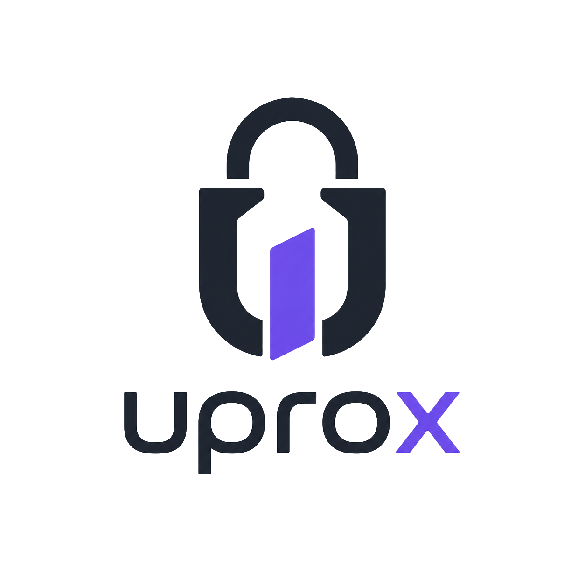
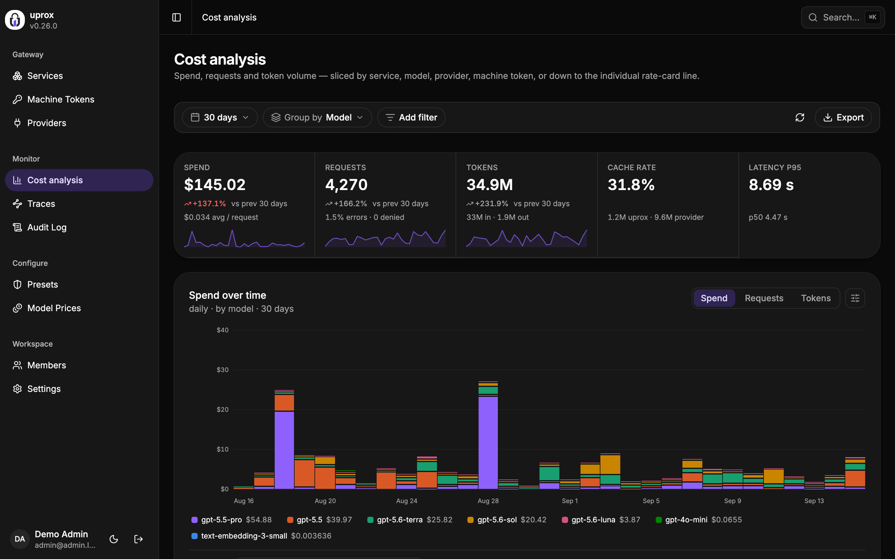
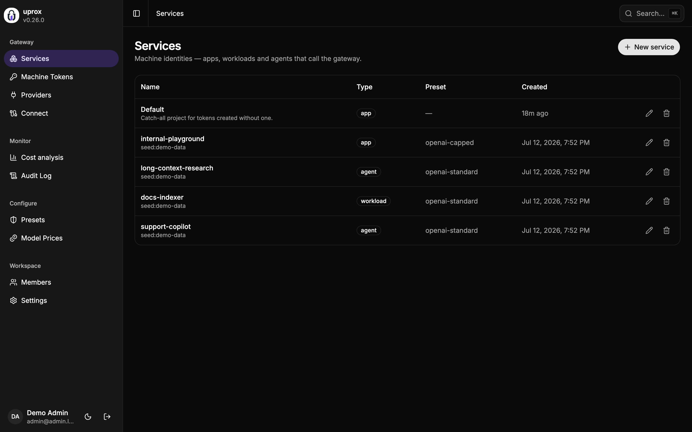
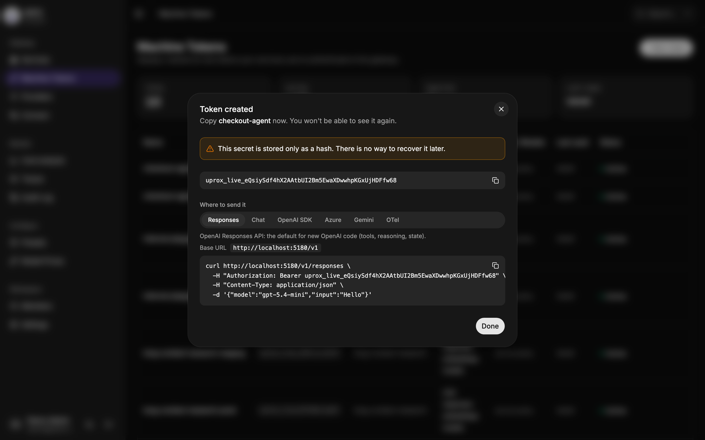

<div align="center">



# uprox

**One OpenAI-compatible endpoint for all your AI workloads — with auth, policy, and cost control built in.**

Point your apps and agents at uprox instead of OpenAI. Hand out revocable tokens instead of
raw provider keys, enforce per-service limits and budgets, and log every request.

[](https://svelte.dev/)
[](https://www.typescriptlang.org/)
[](https://orm.drizzle.team/)
[](./Dockerfile)

<br />

<table>
  <tr>
    <td width="50%"></td>
    <td width="50%"></td>
  </tr>
</table>

</div>

<br />

## Drop-in for the OpenAI SDK

Change two lines — the base URL and the key — and you're routing through uprox:

```ts
import OpenAI from 'openai';

const client = new OpenAI({
	apiKey: 'uprox_live_…', // a revocable machine token, not your real key
	baseURL: 'http://localhost:5173/v1'
});

await client.responses.create({ model: 'gpt-5.4-mini', input: 'Hello' });
// or: client.chat.completions.create({ model: 'claude-sonnet-4-5', messages: [...] })
```

## Which endpoint when

One token, several doors. Pick the one your client already speaks:

| You have…                                   | Base URL         | Use                                                          |
| ------------------------------------------- | ---------------- | ------------------------------------------------------------ |
| New OpenAI code (tools, reasoning)          | `{uprox}/v1`     | `POST /responses`                                            |
| Anything OpenAI-compatible, or mixed models | `{uprox}/v1`     | `POST /chat/completions` — `gpt-*`, `claude-*`, `gemini-*`   |
| Embeddings, images, speech-to-text          | `{uprox}/v1`     | `/embeddings`, `/images/*`, `/audio/transcriptions`          |
| Browser voice (Realtime)                    | `{uprox}/v1`     | `POST /realtime/client_secrets` → client talks to OpenAI     |
| An Azure OpenAI client                      | `{uprox}`        | SDK builds `/openai/deployments/{model}/…` or `/openai/v1/…` |
| The `@google/genai` SDK                     | `{uprox}/v1beta` | `models/{model}:generateContent` — keeps Gemini-only fields  |

The key goes where each SDK expects it: `Authorization: Bearer`, `api-key` (Azure) or
`x-goog-api-key` (Gemini) — uprox accepts all three. When you create a token, the dashboard
shows a ready-to-copy snippet for each of these (also under **Gateway → Connect**):



## What you get

|                    |                                                                                          |
| ------------------ | ---------------------------------------------------------------------------------------- |
| **Machine tokens** | Revocable `uprox_live_…` tokens per service. Stored as a hash; shown once.               |
| **Multi-provider** | OpenAI, Anthropic, Azure OpenAI, and Google Gemini behind one endpoint, routed by model. |
| **Policies**       | Limit which providers/models a service may call, plus per-token rate limits.             |
| **Budgets**        | Daily/monthly USD ceilings per service — over budget returns `402`.                      |
| **Response cache** | Exact-match cache (streaming included) replays responses at zero cost.                   |
| **Encrypted keys** | Provider keys sealed with AES-256-GCM; never exposed to clients.                         |
| **Audit log**      | Every request logged with status, cost, and latency.                                     |
| **Teams & SSO**    | Invite-only orgs and roles, with email/password or OIDC sign-in.                         |

## Quick start

Needs [Node.js](https://nodejs.org), [pnpm](https://pnpm.io), and [Docker](https://www.docker.com).

```sh
pnpm install
cp .env.example .env                 # fill in BETTER_AUTH_SECRET + ENCRYPTION_KEY
pnpm db:start                        # Postgres via docker
pnpm db:migrate
pnpm dev
```

Open <http://localhost:5173>. On first run you'll land on a one-time **`/setup`** wizard to
create the administrator account (it becomes owner of the first organization). After that the
dashboard walks you through it: **add a provider key → create a service → issue a token → make
your first request.** New teammates join by invitation — see [Authentication](#authentication).

```sh
# generate ENCRYPTION_KEY
node -e "console.log(require('crypto').randomBytes(32).toString('base64'))"

# or run the whole thing in Docker
docker build -t uprox . && docker run -p 3000:3000 --env-file .env uprox
```

## Endpoints

Full reference. OpenAI-compatible gateway, authenticated with a `Bearer uprox_live_…` token (or
`api-key: uprox_live_…` for Azure-SDK clients):

| Endpoint                                                            | Notes                                                                                  |
| ------------------------------------------------------------------- | -------------------------------------------------------------------------------------- |
| `POST /v1/chat/completions`                                         | streaming supported                                                                    |
| `POST /v1/responses`                                                | OpenAI Responses API; streaming supported                                              |
| `POST /v1/embeddings`                                               |                                                                                        |
| `POST /v1/images/generations`                                       | image generation (JSON); `gpt-image-1`, `gpt-image-1-mini`, `dall-e-3`                 |
| `POST /v1/images/edits`                                             | image editing (multipart: `image`/`image[]`, optional `mask`, `prompt`, `model`)       |
| `POST /v1/audio/transcriptions`                                     | speech-to-text (multipart); `whisper-1`, `gpt-4o-transcribe`, `gpt-4o-mini-transcribe` |
| `POST /v1/realtime/client_secrets`                                  | mint an ephemeral Realtime token; client connects to OpenAI directly (WebRTC/WS)       |
| `POST /v1/realtime/sessions`, `/v1/realtime/transcription_sessions` | legacy Realtime ephemeral-token endpoints                                              |
| `GET  /v1/models`                                                   | aggregated from your configured providers                                              |
| `/v1/files`, `/v1/files/{id}`, `/v1/files/{id}/content`             | upload/list/retrieve/delete/download — used by SDKs that auto-upload image inputs      |

**Realtime.** uprox mints the ephemeral client secret so your provider key never
reaches the browser; the client then opens the Realtime session (WebRTC or
WebSocket) straight to the provider with that short-lived token. Because that
audio stream doesn't pass through uprox, its per-session token usage isn't
metered here — only the token mint is audited. (A future WebSocket relay could
keep the stream in-path for full metering.)

### Azure OpenAI SDK clients

The same gateway is reachable under URLs the Azure OpenAI SDK builds, so you can
point an existing Azure-style client at uprox by swapping its `AZURE_OPENAI_ENDPOINT`
for your uprox base URL and its `AZURE_OPENAI_API_KEY` for an `uprox_live_…` token.

| Endpoint                                                                    | Equivalent of                                         |
| --------------------------------------------------------------------------- | ----------------------------------------------------- |
| `POST /openai/deployments/{deployment}/chat/completions`                    | legacy per-deployment Azure URL (model from URL)      |
| `POST /openai/deployments/{deployment}/embeddings`                          | legacy per-deployment Azure URL                       |
| `POST /openai/deployments/{deployment}/responses`                           | legacy per-deployment Azure URL                       |
| `POST /openai/responses`                                                    | Responses API on Azure (model from body)              |
| `POST /openai/deployments/{deployment}/audio/transcriptions`                | legacy per-deployment Azure URL                       |
| `POST /openai/deployments/{deployment}/images/generations`, `/images/edits` | legacy per-deployment Azure URL                       |
| `POST /openai/chat/completions`, `POST /openai/embeddings`                  | Azure flat URLs (model from body)                     |
| `POST /openai/audio/transcriptions`                                         | Azure flat URL (model from multipart form)            |
| `POST /openai/images/generations`, `POST /openai/images/edits`              | Azure flat URLs (model from body / multipart form)    |
| `GET  /openai/models`                                                       | Azure model listing                                   |
| `POST /openai/v1/chat/completions` (and `/embeddings`, …)                   | newer Azure OpenAI v1 surface (`api_version=preview`) |

Upstream, uprox talks Azure's v1 surface, so a dated `api-version` is dropped —
except for audio transcriptions, which v1 doesn't serve: those go to Azure's
`/openai/deployments/{model}/audio/transcriptions` with the client's dated
`api-version` (default `2025-03-01-preview`). Model routing is identical
to `/v1/*` — the deployment name acts as the model id, and uprox proxies to Azure
when your org has Azure credentials configured (Azure accepts arbitrary deployment
names; see provider settings).

**Multiple Azure resources.** A provider can hold several keys — add one per Azure
resource (each its own endpoint + key + label) on the Providers page. Each service
then pins which key it uses via the "Upstream key" picker; services left on
_Automatic_ use the provider's highest-`priority` key. This lets you point different
services at different Azure resources (regions, quotas, subscriptions) without
changing any client code.

### Native Google Gemini SDK clients

uprox also exposes a **native Gemini ingress**, so the official `@google/genai`
SDK works without translation — native-only features survive. Point the client's
`baseUrl` at your uprox instance **plus `/v1beta`** and use an `uprox_live_…`
token (the SDK sends it as the `x-goog-api-key` header):

```ts
import { GoogleGenAI } from '@google/genai';

const ai = new GoogleGenAI({
	apiKey: 'uprox_live_…',
	httpOptions: { baseUrl: 'http://localhost:5173/v1beta' } // /v1beta is required
});

await ai.models.generateContent({ model: 'gemini-2.5-flash', contents: 'Hello' });
```

> The `/v1beta` segment must be in `baseUrl`: the SDK appends `/models/{model}:{method}`
> to it verbatim. Omitting it yields `POST /models/…`, which 404s. See
> [`examples/use-gateway-gemini.ts`](examples/use-gateway-gemini.ts).

| Endpoint                                                               | Equivalent of                                |
| ---------------------------------------------------------------------- | -------------------------------------------- |
| `POST /v1beta/models/{model}:generateContent`                          | `ai.models.generateContent`                  |
| `POST /v1beta/models/{model}:streamGenerateContent`                    | `ai.models.generateContentStream` (SSE)      |
| `POST /v1beta/models/{model}:countTokens`                              | `ai.models.countTokens` (free, never billed) |
| `POST /v1beta/models/{model}:embedContent` (and `:batchEmbedContents`) | `ai.models.embedContent`                     |
| `GET  /v1beta/models`, `GET /v1beta/models/{model}`                    | `ai.models.list` / `ai.models.get`           |

Gemini models also work on the OpenAI-compatible `/v1/*` surface above (e.g.
`model: 'gemini-2.5-flash'` on `/v1/chat/completions`) — uprox translates between
the OpenAI and Gemini shapes. Use the native ingress when you want Gemini-specific
request/response fields.

Everything else (services, tokens, providers, policies, audit) is managed in the dashboard or
via the session-authenticated REST API under `/api`.

## Tokens & security

- Machine tokens are opaque (`uprox_live_…`) and stored **only as a sha256 hash** — like a
  password. The plaintext is shown once at creation; revoking one fails its services instantly.
- Provider keys are encrypted at rest with **AES-256-GCM**; only the last 4 chars are kept for
  display, and the gateway swaps the token for the real key server-side — clients never see it.

## Authentication

uprox is **invite-only**. The first account is created once via the `/setup` wizard; everyone
else joins through an organization invitation (email or copy-able link) or via SSO. Sign-in
methods are configured with environment variables — no in-app toggles; set them and restart.

| Variable                                                | Effect                                                                       |
| ------------------------------------------------------- | ---------------------------------------------------------------------------- |
| `EMAIL_AUTH_DISABLED`                                   | `true` hides email/password login, leaving SSO only. Default: email enabled. |
| `OIDC_ISSUER` + `OIDC_CLIENT_ID` + `OIDC_CLIENT_SECRET` | Set all three to enable a "Sign in with SSO" button (any OIDC provider).     |
| `OIDC_PROVIDER_NAME`                                    | Button label (default `Single sign-on`).                                     |
| `OIDC_SCOPES`                                           | Comma-separated scopes (default `openid,email,profile`).                     |

**OIDC setup.** Register uprox with your identity provider (Authentik, Keycloak, Entra ID,
Auth0, …) using this redirect/callback URL:

```
{ORIGIN}/api/auth/oauth2/callback/oidc
```

then set the three `OIDC_*` vars and restart. OIDC users are auto-provisioned on first sign-in.
To stop that, turn off **Settings → Single sign-on → Allow new members to sign up via SSO**:
SSO then only admits existing members and invited addresses.

> **Note:** keep email auth enabled until the first admin exists. If you disable it on an empty
> database the `/setup` wizard can't create an account and you'll be locked out.

## Roles

Every organization has three roles, backed by better-auth's organization plugin:

| Role       | Can do                                                                   |
| ---------- | ------------------------------------------------------------------------ |
| **owner**  | everything, including org-level actions                                  |
| **admin**  | manage providers, policies, services, tokens, pricing, settings, members |
| **member** | read-only — unless an admin grants token/service permissions in Settings |

## Architecture & contributing

Thin routes call server modules grouped by domain. Business logic lives in pure, unit-tested
modules, and client code never value-imports `$lib/server`. Tests come in three layers: unit,
real-SQL on PGlite, and E2E. See [`docs/ARCHITECTURE.md`](docs/ARCHITECTURE.md) for the
structure, rules, and query performance conventions.
The admin REST API is documented in [`docs/API.md`](docs/API.md).

## Built with

SvelteKit · TypeScript · Tailwind v4 + shadcn-svelte · better-auth · Postgres + Drizzle ORM · Node crypto

<details>
<summary><strong>Scripts</strong></summary>

| Command                                     | Description                          |
| ------------------------------------------- | ------------------------------------ |
| `pnpm dev` / `build` / `preview`            | dev / production build / preview     |
| `pnpm check` / `lint`                       | typecheck / prettier + eslint        |
| `pnpm test`                                 | unit + DB + E2E                      |
| `pnpm test:unit` / `test:db`                | Vitest unit / real SQL on PGlite     |
| `pnpm test:e2e`                             | Playwright (`test:e2e:install` once) |
| `pnpm db:migrate` / `db:push` / `db:studio` | database                             |
| `pnpm auth:schema`                          | regenerate the better-auth schema    |

</details>
